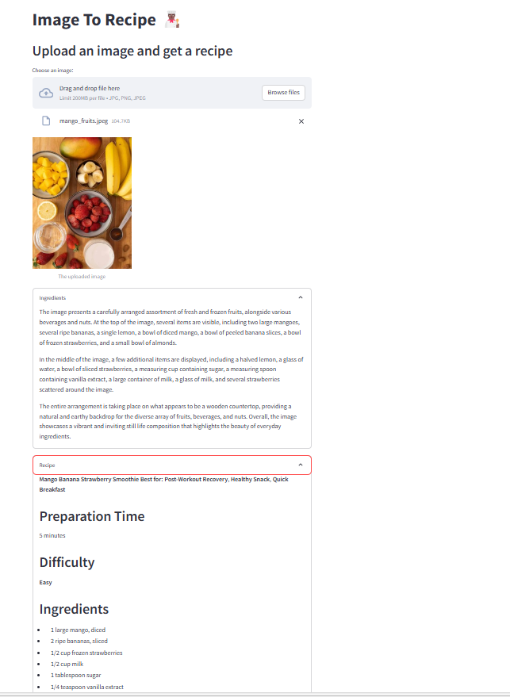

# 🍽️ AI-Powered Image-to-Recipe Generator

## 📌 Overview
The **AI-Powered Image-to-Recipe Generator** is an innovative project that uses **AI vision models** to detect ingredients in an image and generate a structured **healthy recipe** using **LangChain, LLaMA-3.3-70B (Groq API), and Streamlit**.

## 🚀 Features
✅ **Detects ingredients from images** using AI vision models.  
✅ **Generates structured recipes** with macros, cooking steps, and preparation details.  
✅ **Includes meal type recommendations** (e.g., weight loss, bodybuilding, high-protein).  
✅ **Simple, fast, and interactive UI** built with **Streamlit**.  
✅ **Supports uploading images in JPG & PNG formats**.  

## 🛠️ Tech Stack
- **Python 3.9+**
- **LangChain** (AI-driven text generation)
- **LLaMA-3.3-70B** (Groq API for LLM processing)
- **Groq Vision API** (For analyzing images)
- **Base64 Encoding** (For processing image inputs)
- **Streamlit** (Web UI)

## 📂 Project Structure
```
📁 AI-Recipe-Generator
│── 📄 app.py               # Streamlit application
│── 📄 requirements.txt     # Dependencies
│── 📝 README.md            # Documentation
│── 📄 .env                 # API keys (Groq API key required)
```

## 📦 Installation & Setup
### 1️⃣ Clone the repository
```bash
git clone https://github.com/yourusername/AI-Recipe-Generator.git
cd AI-Recipe-Generator
```

### 2️⃣ Create a virtual environment
```bash
python -m venv venv
source venv/bin/activate  # macOS/Linux
venv\Scripts\activate   # Windows
```

### 3️⃣ Install dependencies
```bash
pip install -r requirements.txt
```

### 4️⃣ Set up API Keys
Create a `.env` file in the root directory and add your **Groq API key**:
```
GROQ_API_KEY=your_groq_api_key_here
```

### 5️⃣ Run the application
```bash
streamlit run app.py
```

## 🎯 Usage Instructions
1️⃣ **Upload a picture** of ingredients using the Streamlit web interface.  
2️⃣ **AI detects the ingredients** in the image.  
3️⃣ **AI generates a structured recipe** including:
   - Name of the dish
   - Best meal category
   - Preparation time & difficulty level
   - Required kitchen tools
   - Cooking instructions
   - Macros (Calories, Protein, Carbs, Fats)  
4️⃣ **View or download the recipe as needed**.  

## 🖼️ Example Output
  

## 🛠️ Troubleshooting
### If `FAISS` or `LangChain` fails to install:
```bash
pip uninstall faiss langchain -y
pip install faiss-cpu langchain
```

### If API errors occur:
- Make sure your **Groq API key** is correct.
- Check your `.env` file settings.

## 🤝 Contribution
We welcome contributions! Feel free to:
- Open an issue
- Submit a pull request
- Suggest improvements


